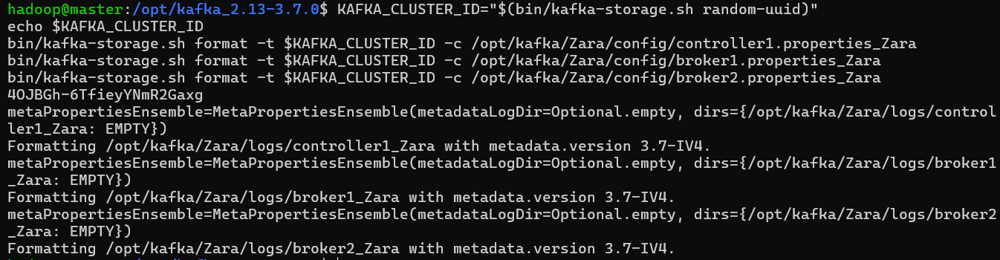
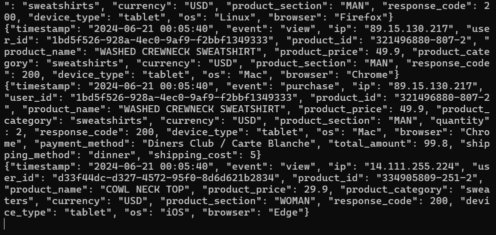
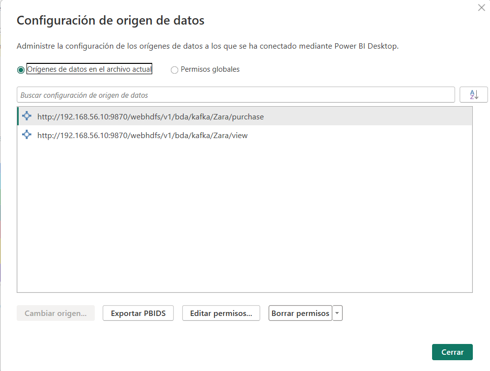
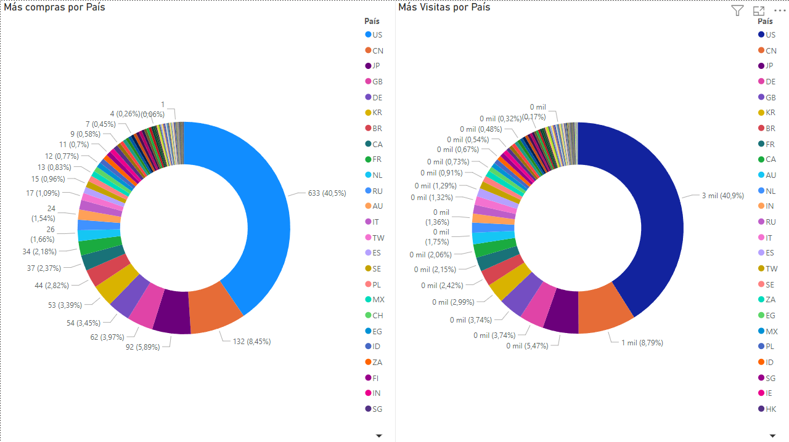
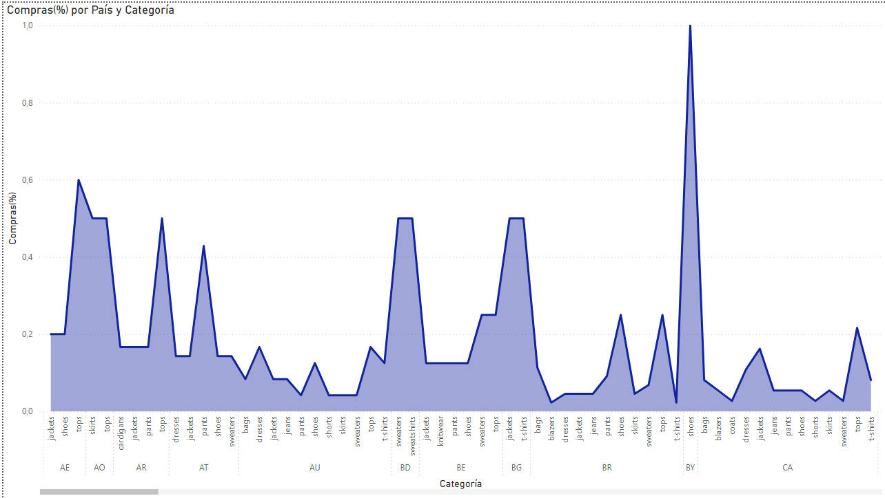
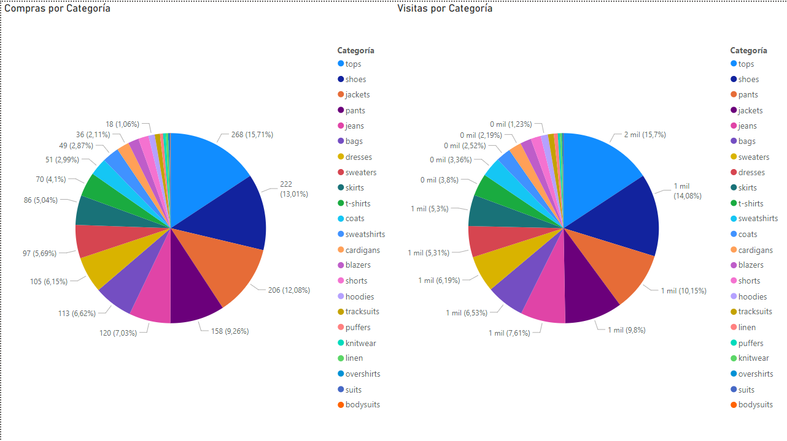

# Análisis de eventos de streaming de Zara - Proyecto de Big Data
## Introduction

Este proyecto tiene como objetivo analizar los eventos de streaming de Zara, una empresa de moda española.
Los datos que vamos a analizar son creados sintéticamente, intentando simular el comportamiento de los usuarios en la web de Zara.

## Estructura del proyecto

El proyecto está estructurado de la siguiente manera:

- `csv/`: Contiene los datos de los que partimos para realizar la generación de eventos.
- `kafka/`: Contiene el programa encargado de la generación de eventos y el envío de los mismos a Kafka.
- `spark/`: Contiene el programa encargado de la lectura de los eventos de Kafka y el análisis de los mismos.
- `img/`: Contiene las imágenes utilizadas en la documentación.
- `Zara.pbix`: Archivo de Power BI con el análisis de los datos.
- `README.md`: Documentación del proyecto.

## Requisitos previos

Para la ejecución de este proyecto es necesario tener instalado y configurado lo siguiente:

- 4 sistemas operativos Linux (1 para el master y 3 para los nodos).
- Tener configurado un cluster de Hadoop y Spark.
- Tener instalado Kafka.

## Configuración del proyecto

Primero de todo, aclarar las direcciones IP de los sistemas operativos:

- `Anfitrión`:
    - IP: 192.168.56.1/24
- `Master`:
    - IP: 192.168.56.10/24
    - RED NAT: 192.168.11.10/24
    - HOST_NAME: master / cluster-bda
- `Nodo1`:
    - IP: 192.168.56.11/24
    - RED NAT: 192.168.11.11/24
    - HOST_NAME: nodo1
- `Nodo2`:
    - IP: 192.168.56.12/24
    - RED NAT: 192.168.11.12/24
    - HOST_NAME: nodo2
- `Nodo3`:
    - IP: 192.168.56.13/24
    - RED NAT: 192.168.11.13/24
    - HOST_NAME: nodo3

Para la configuración del proyecto es necesario seguir los siguientes pasos:

1. Preparación del entorno de trabajo.

    En nuestro directorio de kafka, creamos una carpeta llamada `zara` y dentro de ella creamos las siguientes carpetas:
    
    - `logs/`: Contiene los logs de Kafka.
      - `config/`: Contiene los ficheros de configuración de Kafka.
    
    Dentro de la carpeta `config/` copiamos los siguientes ficheros:
    
    - `controller1.properties_Zara`: Contiene la configuración del controlador de Kafka.
      - `broker1.properties_Zara`: Contiene la configuración del broker de Kafka.
      - `broker2.properties_Zara`: Contiene la configuración del broker de Kafka.
    
    ```bash
    cp config/kraft/controller.properties /opt/kafka/Zara/config/controller1.properties_Zara
    cp config/kraft/broker.properties /opt/kafka/Zara/config/broker1.properties_Zara
    cp config/kraft/broker.properties /opt/kafka/Zara/config/broker2.properties_Zara
    ```

2. Configuración de los ficheros de configuración.

    Configuramos los ficheros de configuración de la siguiente manera:
    
    - `controller1.properties_Zara`:
    
    ```bash
    # Server Basics
    process.roles=controller
    node.id=1
    controller.quorum.voters=1@localhost:9093
    # Socket Server Settings
    listeners=CONTROLLER://localhost:9093
    controller.listener.names=CONTROLLER
    # Log Basics
    log.dirs=/opt/kafka/Zara/logs/controller1_Zara
    ```
    
    - `broker1.properties_Zara`:
    
    ```bash
    # Server Basics
    process.roles=broker
    node.id=2
    controller.quorum.voters=1@localhost:9093
    # Socket Server Settings
    listeners=PLAINTEXT://0.0.0.0:9094
    advertised.listeners=PLAINTEXT://192.168.56.10:9094
    # Log Basics
    log.dirs=/opt/kafka/ejemplo4/logs/broker1_Zara
    ```
    
    - `broker2.properties_Zara`:
    
    ```bash
    # Server Basics
    process.roles=broker
    node.id=3
    controller.quorum.voters=1@localhost:9093
    # Socket Server Settings
    listeners=PLAINTEXT://0.0.0.0:9095
    advertised.listeners=PLAINTEXT://192.168.56.10:9095
    # Log Basics
    log.dirs=/opt/kafka/ejemplo4/logs/broker2_Zara
    ```
    
    ---
    `IMPORTANTE:`
    
    Abrir el acceso en `listeners` configurando la ip como 0.0.0.0:puerto. No sería la mejor solución, 
    ya que debemos filtrar el acceso desde advertised.listeners y este valor, por configuración propia de Kafka, 
    debe ser un subconjunto de listeners. En producción, se debería configurar un firewall para filtrar el acceso.
    ---

3. Iniciamos Kafka con KRaft.

    Para iniciar Kafka con KRaft, ejecutamos los siguientes comandos desde el directorio de Kafka en el nodo `master` y 
    en su ruta correspondiente (`/opt/kafka_2.13-3.7.0/`):
    
    ```bash
    KAFKA_CLUSTER_ID="$(bin/kafka-storage.sh random-uuid)" 
    echo $KAFKA_CLUSTER_ID
    bin/kafka-storage.sh format -t $KAFKA_CLUSTER_ID -c /opt/kafka/Zara/config/controller1.properties_Zara
    bin/kafka-storage.sh format -t $KAFKA_CLUSTER_ID -c /opt/kafka/Zara/config/broker1.properties_Zara
    bin/kafka-storage.sh format -t $KAFKA_CLUSTER_ID -c /opt/kafka/Zara/config/broker2.properties_Zara
    ```
   
    

    Iniciamos el controlador y los brokers:
    
    ```bash
    bin/kafka-server-start.sh /opt/kafka/Zara/config/controller1.properties_Zara
    bin/kafka-server-start.sh /opt/kafka/Zara/config/broker1.properties_Zara
    bin/kafka-server-start.sh /opt/kafka/Zara/config/broker2.properties_Zara
    ```
   
4. Creación de los topics.

    Creamos un topic llamado `zara-view` y otro llamado `zara-purchase`, con 2 particiones y un factor de replicación de 
    2 para que se repliquen en los dos brokers y se distribuyan en las dos particiones.
    
    ```bash
    bin/kafka-topics.sh --create --topic zara-view --bootstrap-server 192.168.11.10:9094 --replication-factor 2 --partitions 2
    bin/kafka-topics.sh --create --topic zara-purchase --bootstrap-server 192.168.11.10:9094 --replication-factor 2 --partitions 2
    ```
   
Con estos pasos ya tendríamos configurado nuestro entorno de trabajo para la ejecución del proyecto.

## Producción de eventos

Para la producción de eventos, ejecutamos el programa `producer.py` en nuestra máquina anfitriona.
En mi caso lo puedo ejecutar desde el mismo entorno de desarrollo de PyCharm.

Este programa se encarga de generar eventos de visualización y de compra de productos de Zara y enviarlos a Kafka.

Si quieres saber más sobre cómo se generan los eventos, puedes consultar el programa [producer.py](kafka/producer.py).

Una vez que hemos ejecutado el programa, podemos comprobar que los eventos se han enviado correctamente a Kafka.

```bash
bin/kafka-console-consumer.sh --topic zara-view --from-beginning --bootstrap-server 192.168.11.10:9094 & \
bin/kafka-console-consumer.sh --topic zara-purchase --from-beginning --bootstrap-server 192.168.11.10:9094
```



## Análisis de eventos

Para el análisis de eventos, ejecutamos el programa `consumer.py` en nuestra máquina master.

Este programa se encarga de leer los eventos de Kafka y realizar un análisis de los mismos.

Si quieres saber más sobre cómo se analizan los eventos, puedes consultar el programa [spark_zara.py](spark/spark_zara.py).

```bash
spark-submit --packages org.apache.spark:spark-sql-kafka-0-10_2.12:3.5.0 --master spark://192.168.11.10:7077 spark_zara.py
```

## Persistencia de datos

Para la persistencia de datos, utilizamos un sistema de almacenamiento en HDFS.

En este caso, guardamos los datos en formato parquet en la carpeta `/bda/kafka/zara`.

```bash
hdfs dfs -mkdir /bda/kafka/zara
```

## Visualización de datos

Para la visualización de datos, utilizamos un sistema de visualización de datos como Power BI.

En este caso, cargamos los datos en formato parquet en Power BI y realizamos un análisis de los mismos.

Para importar los datos en Power BI, seguimos los siguientes pasos:

1. Abrimos Power BI y seleccionamos la opción `Obtener datos`.
2. Seleccionamos la opción `HDFS`.
3. Introducimos la dirección del sistema de almacenamiento HDFS. (En nuestro caso `hdfs://cluster-bda:9000/bda/kafka/zara`).
4. Seleccionamos la carpeta que contiene los datos.
5. Cargamos los datos en Power BI.
6. Realizamos un análisis de los datos.

## Ejecución del proyecto

Para la ejecución del proyecto, seguimos los siguientes pasos:

1. Iniciar Kafka con KRaft en el nodo `master`.

    Este paso solo lo realizamos una vez, ya que no es necesario reiniciar Kafka cada vez que ejecutamos el proyecto.

    ```bash
    KAFKA_CLUSTER_ID="$(bin/kafka-storage.sh random-uuid)" 
    echo $KAFKA_CLUSTER_ID
    bin/kafka-storage.sh format -t $KAFKA_CLUSTER_ID -c /opt/kafka/Zara/config/controller1.properties_Zara
    bin/kafka-storage.sh format -t $KAFKA_CLUSTER_ID -c /opt/kafka/Zara/config/broker1.properties_Zara
    bin/kafka-storage.sh format -t $KAFKA_CLUSTER_ID -c /opt/kafka/Zara/config/broker2.properties_Zara
    ```

2. Iniciar el controlador y los brokers en el nodo `master`.

    ```bash
    bin/kafka-server-start.sh /opt/kafka/Zara/config/controller1.properties_Zara
    bin/kafka-server-start.sh /opt/kafka/Zara/config/broker1.properties_Zara
    bin/kafka-server-start.sh /opt/kafka/Zara/config/broker2.properties_Zara
    ```
   
3. Crear los topics en el nodo `master`.

    ```bash
    bin/kafka-topics.sh --create --topic zara-view --bootstrap-server 192.168.11.10:9094 --replication-factor 2 --partitions 2
    bin/kafka-topics.sh --create --topic zara-purchase --bootstrap-server 192.168.11.10:9094 --replication-factor 2 --partitions 2
    ```
   
4. Activar los consumidores en el nodo `master`.

    ```bash
    bin/kafka-console-consumer.sh --topic zara-view --from-beginning --bootstrap-server 192.168.11.10:9094 & \
    bin/kafka-console-consumer.sh --topic zara-purchase --from-beginning --bootstrap-server 192.168.11.10:9094
    ```
   
5. Iniciar los servicios de Hadoop y Spark en el nodo `master`, en sus respectivas rutas.

    ```bash
    start-dfs.sh
    ./sbin/start-master.sh
    ./sbin/start-workers.sh
    ```
   
6. Desavilitar el modo seguro de Hadoop en el nodo `master`.

    ```bash
    hdfs dfsadmin -safemode leave
    ```
   
7. Ejecutar el programa `producer.py` en la máquina anfitriona.

8. Ejecutar el programa `spark_zara.py` en el nodo `master`.

    ```bash
    spark-submit --packages org.apache.spark:spark-sql-kafka-0-10_2.12:3.5.0 --master spark://192.168.11.10:7077 spark_zara.py
    ```
   
9. Realizar un análisis de los datos en Power BI.

Lo primero que hacemos es importar los datos en Power BI.



Una vez que hemos importado los datos, realizamos un análisis de los mismos.

- Primer Gráfico: Compras y Visitas por país.



- Segundo Gráfico: Porcentaje de compras por categoría y país.



 - Tercer Gráfico: Compras y Visitas por categoría.



Con estos pasos ya tendríamos terminado nuestro proyecto de Big Data.